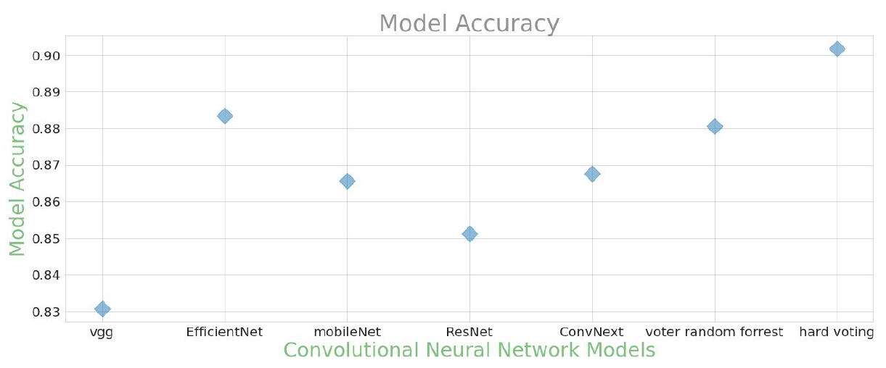
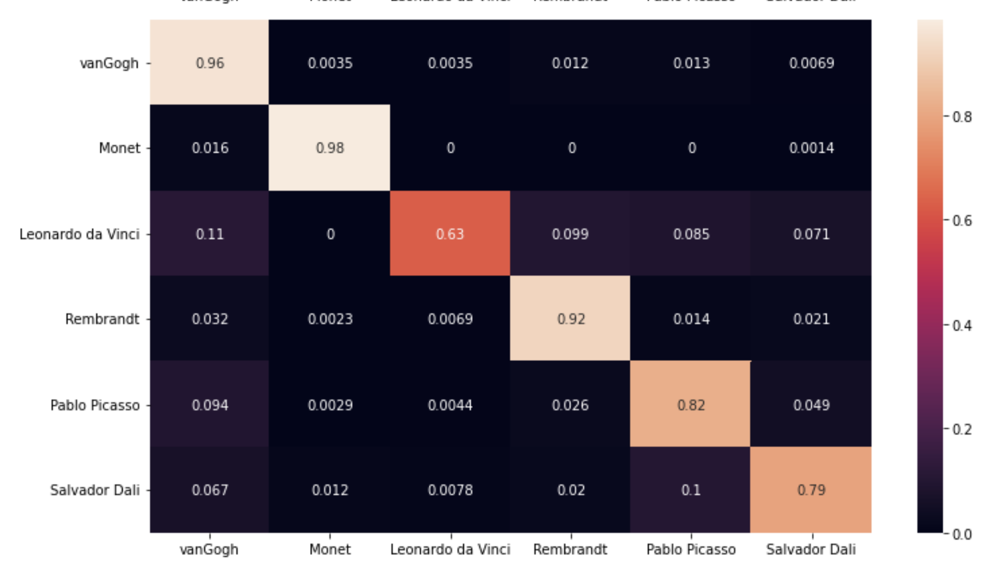
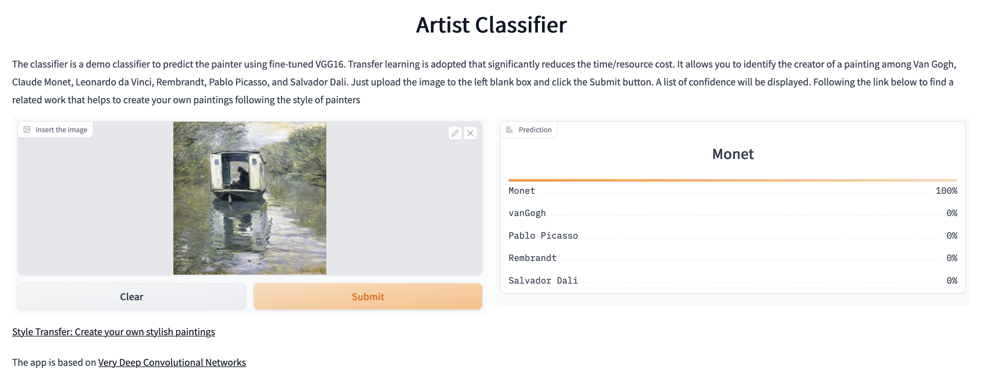
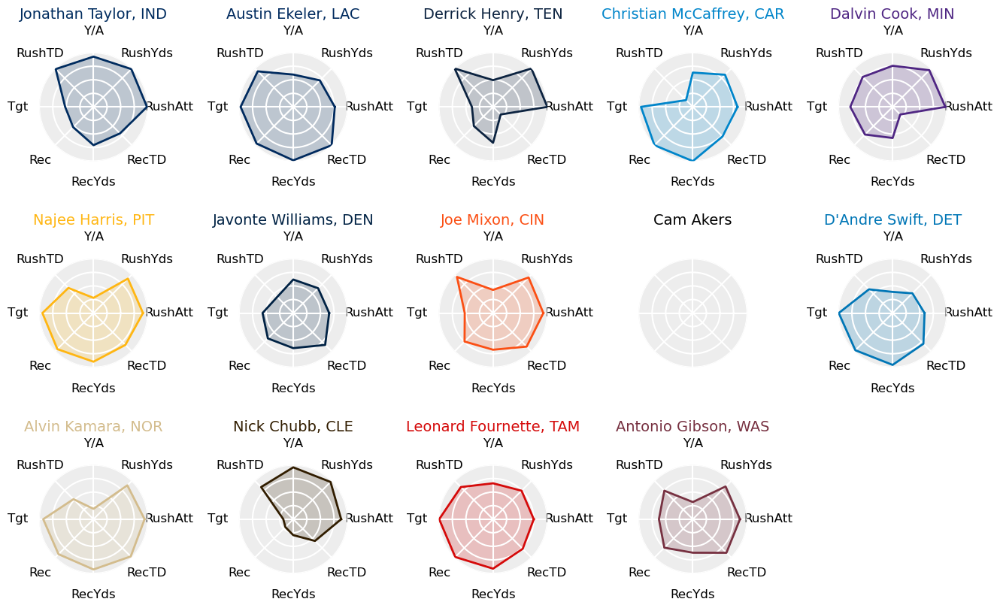

# Bryan's Project Page

Welcome to my personal project webpage! I'll be using this page to compile my projects into one convenient location as I use data science to tackle interesting questions (and learn some useful skills along the way).

See below for summaries of my featured projects and click the titles for links to their respective repositories on GitHub where full, detailed Readme files and source code may be viewed.

## 1. [Artist Classifier and Image Style Transfer with Machine Learning](https://github.com/breynolds1247/artistClassifier_and_styleTransfer)

*This project was completed as a group project for The Erdos Institute Data Science Bootcamp and was recognized as a top project from the Summer 2022 cohort.*

**Technical skills used in this project:** Machine learning (Neural networks, Ensemble modeling, Decision trees, Random Forest, Voters), Transfer learning, Python (PyTorch, TensorFlow, SciKit-learn, Pandas, NumPy, Gradio)

The artist classifier portion of this project aims to identify the artists of paintings using transfer learning with convolutional neural networks (CNNs) and ensemble modeling techniques. Six artists were chosen for this project: Claude Monet, Vincent van Gogh, Leonardo da Vinci, Rembrandt, Pablo Picasso, and Salvador Dali. We downloaded images of their art from a combination of Kaggle datasets and the WikiArt database. We manually cleaned the dataset by deleting images that are not paintings (sculptures, posters, photos, etc.), as well as ensuring that there were no duplicate images. We then divided the data into three parts: 20% for training, 10% for validation and 70% for testing. The training and validation sets are small because there is a finite, limited amount of paintings by those artists. If we use a large portion for training, it will be very likely that the painting submitted by the user to the art classifier app is one of the training paintings, which defeats the purpose of using machine learning to classify the artist.

For the model training, we tried five pre-trained CNNs from pytorch: EfficientNet, ConvNext, MobileNet, ResNet and VGG16. We fine tuned the model via transfer learning techniques, which drastically reduced the training time compared to training models from scratch. We also used a free GPU on Google Colaboratory to speed up the training process. All models were trained with the same training/validation/test set. They perform similarly for different artists, with da Vinci seemingly the most difficult to classify in all models. Individual model accuracy ranges between 83% - 88%. We implemented a random forest voter model, but found that it failed to increase the performance above that of the top performing CNN model. However, we found that implementing a hard voting model led to an increase in accuracy, up to approximately 90%.

  

  

  

The same techniques used by pre-trained CNNs to classify different images based on identification of features of their artist’s style can be used to transfer those features to other images. More specifically, a model can be fine-tuned on an image to learn its style, and then that style can be applied to a new image. A popular tool for this is Magenta, which is available in TensorFlow_Hub and is based on the framework of the MobileNet CNN, and we used it to build the artist style transfer tool.

Interactive web applications have been deployed for the [artist classifier](https://huggingface.co/spaces/czkaiweb/StarryNight) and the [style transfer model](https://huggingface.co/spaces/breynolds1247/StarryNight_StyleTransfer). Play around and have fun! 

  

  

  

## 2. [Web Scraping and Visualizing NFL Fantasy Football Stats](https://github.com/breynolds1247/projects/tree/main/NFLPlayerStatVisualizations)

**Technical skills used in this project:** Python (Pandas, Matplotlib, Numpy, BeautifulSoup), Web Scraping, Data Cleaning, Plotting/Visualizations

This project was fairly simple, but was a fun way to practice web scraping with the Beautiful Soup package and to keep my Pandas and Matplotlib skills sharp, all while making some interesting data visualizations to help prepare for the upcoming fantasy football season!

As a scientist and an avid sports fan, I love fantasy sports. Given the huge amounts of data available about each player and team in a given professional sports league, it is an excellent venue use data to discover trends and insights. For a data enthusiast like myself, the possibilities are virtually endless. 

The problem is that while it is easy to find publicly available data, it is often not in a format usable for any sort of analysis or simple visualization. For this reason, I wanted to take the opportunity to try out web scraping techniques to create my own datasets. I set out to write an algorithm that could extract NFL player data from this past season (2021-22) while being simple enough to be easily adapted for future use in data extraction from other sources. To accomplish this, I used Python with the Beautiful Soup package to extract data from the pro-football-reference.com website.

Finally, after the web scraping was successfully performed, I obviously wanted to do something with my shiny new data set. To start, I decided to make some visualizations of the player stats most relevant to fantasy football for each major position group. More sophisticated analysis using machine learning techniques is coming soon in future projects!

The data visualizations that were created are in the form of radar charts (or, as I know them, "spider graphs") showing each player's percentile ranking in the major statistical categories for their position group. Spider graphs are commonly used to visualize the combine performance of NFL draft prospects, so I thought that it would be an interesting exercise to extend their use to fantasy-relevant data. In the "Results & Analysis" section, I present the spider graphs for most of the projected contributors in fantasy drafts for this upcoming NFL season and discuss some observations that can be made.

  

